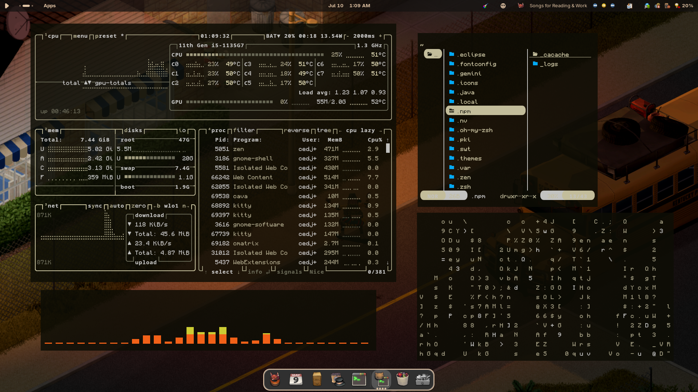
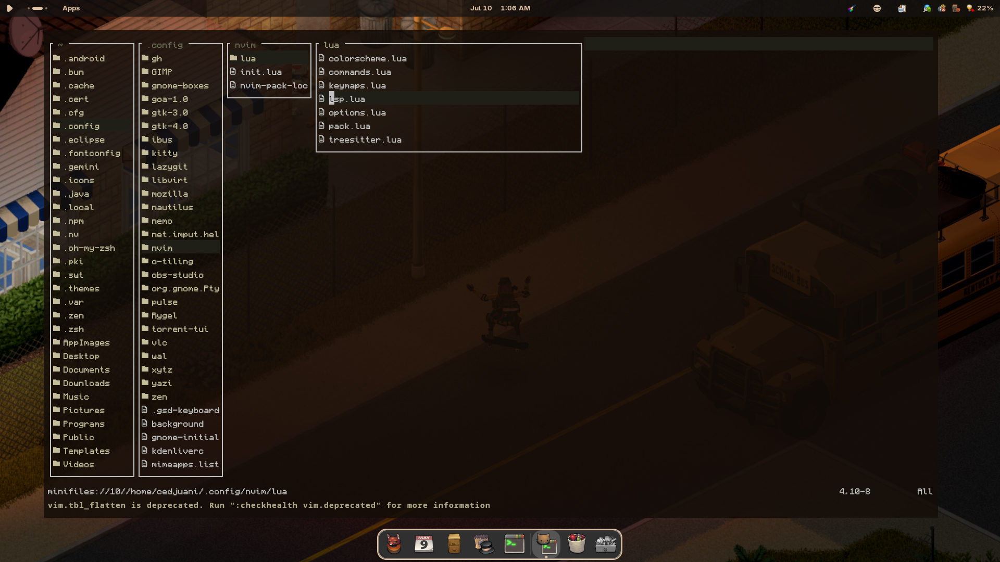
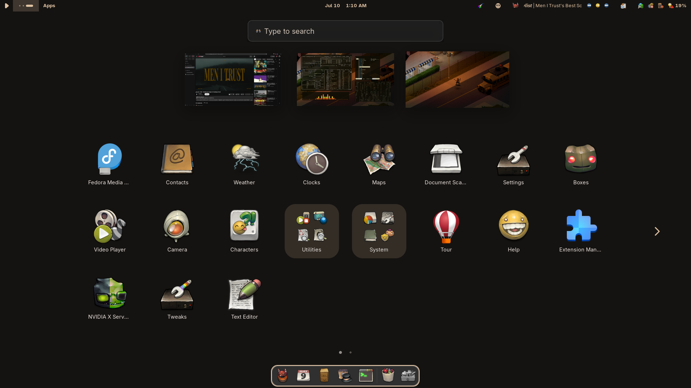
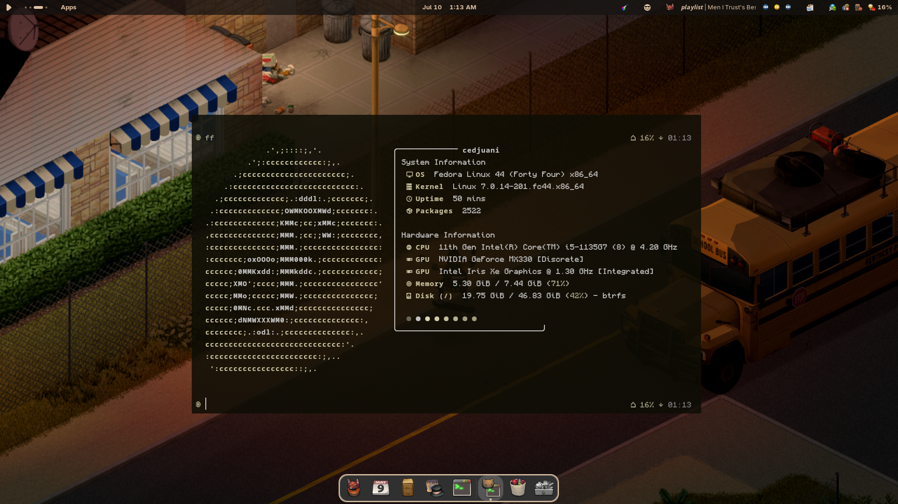
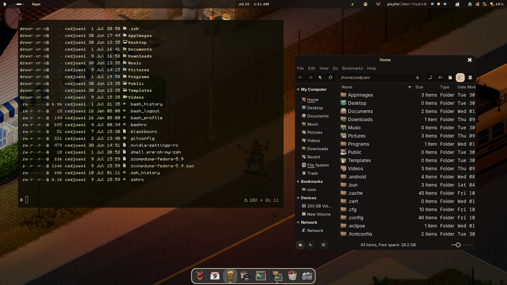
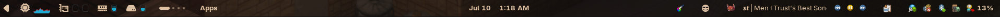

<h1 align="center">🏵️ dotfiles</h1>

<div align="center">
  
</div>

<div align="center">
  
  
</div>

<div align="center">
  
  
</div>


<div align="center">
  
</div>
---

## ✨ Features

- 🐧 Tailored **GNOME Shell** configuration
- 🎨 Material styling across GTK-4.0 & legacy windows
- 🐚 Polished **Zsh** terminal experience
- 🐈 Fast, GPU-accelerated **Kitty** terminal configuration
- ⌨️ Highly efficient **Neovim** IDE layer
- 📂 Lightning-fast TUI navigation via **Yazi**

---

## 🌸 Core System Info

- **OS:** [Fedora Linux](https://fedoraproject.org/) ❄️
- **DE:** [GNOME](https://www.gnome.org/) 🪟
- **Shell:** [Zsh](https://www.zsh.org/) 🐚
- **Terminal Emulator:** [Kitty](https://sw.kovidgoyal.net/kitty/) >_
- **Text Editor:** [Neovim](https://neovim.io/) ⌨️
- **File Manager (GUI):** [Nemo](https://github.com/linuxmint/nemo) 📂
- **File Manager (TUI):** [Yazi](https://yazi-rs.github.io/) 🦅
- **GTK / Shell Theme:** [Material-GNOME-Theme](https://www.gnome-look.org/p/2363252) 🎨
- **Icons:** [Buuf Icons](https://store.kde.org/s/Opendesktop/p/1012233/) 🍩

---

### ℹ️ Whole System Info

<details>
<summary>🖥️ <b>CLI/TUI Apps</b></summary>

<br>

| 📚 Entry | ✨ App |
| :--- | :--- |
| **Shell** | `zsh` |
| **Terminal Emulator** | `kitty` |
| **Text Editor** | `neovim` |
| **LS Replacement** | `exa` |
| **File Manager (TUI)** | `yazi` |
| **System Fetch** | `fastfetch` |

</details>

<details>
<summary>🖱️ <b>GUI & Desktop Environment</b></summary>

<br>

| 📚 Entry | ✨ App / Assets |
| :--- | :--- |
| **Desktop Environment** | GNOME |
| **File Manager (GUI)** | Nemo |
| **GTK-4.0 / Legacy Theme** | Material-GNOME-Theme |
| **Icon Pack** | Buuf Icons |

</details>

---

## 🚀 Setup

Since these dotfiles are managed via a bare repository, they can be replicated onto a new machine with the following commands:

```bash
# Clone the repository as a bare repo
git clone --separate-git-dir=$HOME/.cfg <REPOSITORY_URL> temp_dotfiles

# Copy files over to $HOME and clean up temporary directory
rsync --exclude '.git' -av temp_dotfiles/ $HOME/
rm -rf temp_dotfiles

# Define the alias for managing the dotfiles
alias dotfiles='/usr/bin/git --git-dir=$HOME/.cfg/ --work-tree=$HOME'

# Hide untracked files to keep git status clean
dotfiles config --local status.showUntrackedFiles no

# Checkout the files
dotfiles checkout
